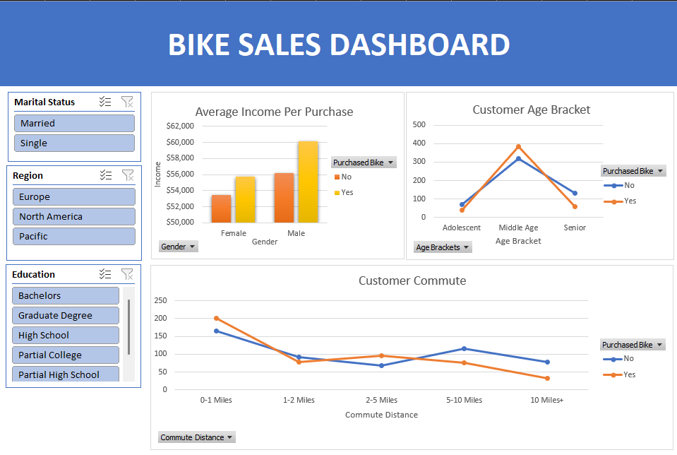

# Bike Sales Analysis – Excel Dashboard

## Project Overview
This project analyzes customer demographic and behavioral data to understand factors associated with bike purchasing behavior. The analysis follows a complete data analytics workflow, including data cleaning, exploratory analysis, and dashboard creation, using Microsoft Excel.

The goal of this project is to transform raw customer data into actionable insights that can support business and marketing decisions.

---

## Business Question
**Which customer characteristics are most strongly associated with bike purchases?**

Specifically, this analysis explores how income level, age group, commute distance, and region relate to purchasing behavior.

---

## Tools & Skills Used
- Microsoft Excel
- Data Cleaning & Preparation
- Pivot Tables
- Charts & Data Visualization
- Slicers & Interactive Dashboards
- Exploratory Data Analysis (EDA)

---

## Data & Analysis Workflow
1. **Raw Data Ingestion**  
   Imported the original bike sales dataset containing customer demographics and purchase indicators.

2. **Data Cleaning & Preparation**  
   - Standardized categorical values  
   - Created derived columns (age brackets, commute distance categories)  
   - Ensured consistency for analysis and reporting  

3. **Exploratory Analysis**  
   Used pivot tables to analyze purchasing behavior across multiple dimensions, including income, age, commute distance, and region.

4. **Dashboard Development**  
   Built an interactive Excel dashboard with slicers to allow users to dynamically explore customer segments and purchasing patterns.

---

## Project Files
- `data/bike_sales_raw.xlsx` – Original raw dataset  
- `analysis/bike_sales_cleaned.xlsx` – Cleaned and prepared dataset  
- `analysis/bike_sales_pivot_tables.xlsx` – Pivot table analysis  
- `dashboard/bike_sales_dashboard.xlsx` – Final interactive Excel dashboard  

---

## Key Insights
- Middle-aged customers accounted for the highest number of bike purchases.
- Customers with shorter commute distances demonstrated higher purchase rates.
- Bike purchasers tended to have slightly higher average income compared to non-purchasers.
- Purchasing behavior varied by region, highlighting potential geographic targeting opportunities.

---

## Dashboard Preview

---
